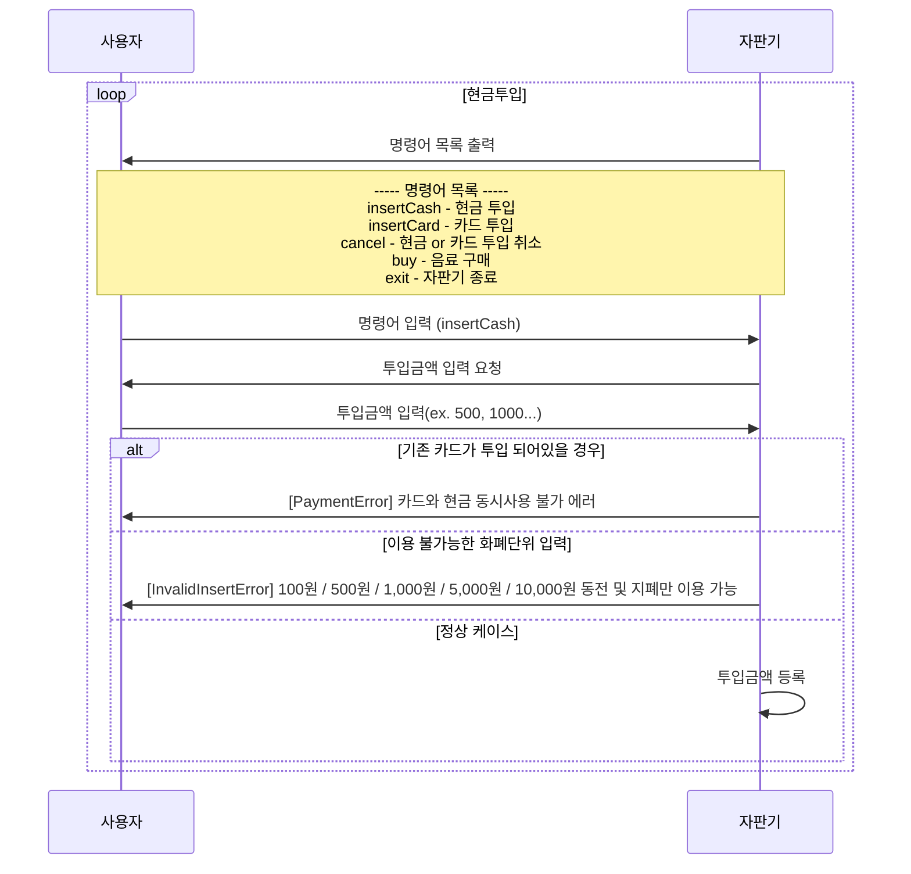
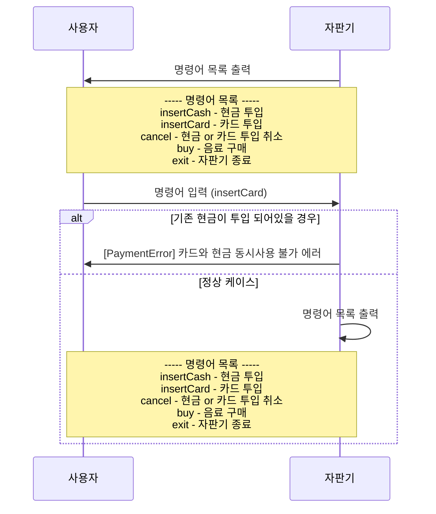
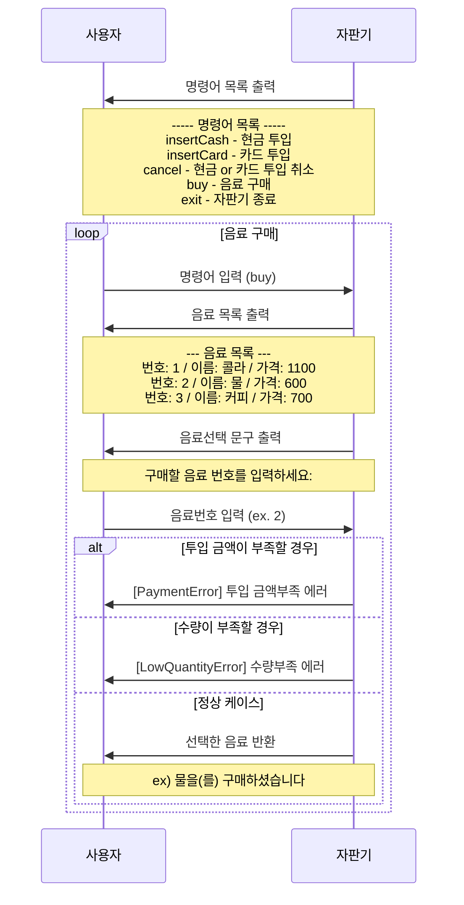

# 자판기

## Requirement

----
- Java 21

## Getting Started

----

```shell
# build
./gradlew :subproject:boot:build

# run 
java -jar subproject/boot/build/libs/boot.jar
```

## Structure

----

Layered Architecture 구조 기반으로 모듈이 domain / application / infrastructure 나누어져 있으며, 엔트리 포인트인 boot 모듈이 구성되어 있습니다.<br/><br/>

    ├── boot                            엔트리 포인트 모듈, 자판기 command line 입력 흐름 작성
    ├── application                     비즈니스 로직 흐름 및 트랜잭션을 제어하는 레이어
    ├── domain                          도메인 객체 명세 및 행동을 정의하는 레이어
    └── infrastructure                  DB access / external api call 등 외부와의 outbound 통신을 담당하는 레이어

## Code Style

----

- **Koin DI Library 사용** - Spring 은 불필요해 보여 간단히 DI 기능만 제공해주는 Koin 라이브러리만 적용하였습니다.
- **Effect(함수형 Either 와 같은 개념)** - 위 Structure 설명대로 Layered Architecture 구조에서 domain 객체를 제외한 로직들은 성공 / 실패 케이스를 모두 응답값으로 반환하도록 하여 발생할 수 있는 실패 케이스 또한 명세화 하도록 하였습니다. 일반적인 exception 전파로 관리할 경우 호출부에서 모든 exception 케이스를 핸들링 한다는게 보장되지 않는데 반해 실패 케이스를 반환타입으로 관리할 경우 코드 내에서 명확한 처리를 보장할 수 있습니다.
- **기능단위 함수** - 일반적으로 사용하는 Service 클래스를 정의하지 않고 public 메서드 단위로 의존성을 관리하고 호출될 수 있도록 클래스화 하였습니다.

**example code)**
```kt
class BuyDrinkWithCoin(
    private val drinkRepository: DrinkRepository,
    private val validateBuyingAvailable: ValidateBuyingAvailable,
) {
    sealed interface Failure {
        data object NotFound : Failure

        data object InsufficientQuantity : Failure

        data object InsufficientCoin : Failure
    }

    operator fun invoke(
        id: Base.Id,
        insertedCoin: Int,
    ): Effect<Failure, Int> =
        effect {
            val drink =
                validateBuyingAvailable(id)
                    .mapError {
                        when (it) {
                            ValidateBuyingAvailable.Failure.NotFound -> Failure.NotFound
                            ValidateBuyingAvailable.Failure.InsufficientQuantity -> Failure.InsufficientQuantity
                        }
                    }.bind()

            ensure(drink.checkAvailableBuy(insertedCoin)) {
                raise(Failure.InsufficientCoin)
            }

            drinkRepository.save(drink.buy()).bind()

            insertedCoin - drink.price.value
        }
}
```

## Test

----

application 모듈 기능들을 통합 테스트 하는 형태로 각 기능들을 검증 하였으며 test fixtures 를 따로 분리하여 최대한 테스트 흐름에 집중할 수 있도록 하였습니다. <br/>

외부 호출에 대하여 아래와 같은 규칙을 가지고 있습니다.
- External API call - 호출 메서드에 대한 input / output 을 지정하여 mocking

[테스트 파일 경로 이동](subproject/application/src/test/kotlin/io/vending/machine/application)

## 흐름

----

### 현금 투입 예

현금 투입 -> 음료 구매
기본적으로 현금을 투입하고 음료를 구매하는 흐름 입니다.<br/> 실생활에서의 자판기와 같이 현금투입 이후 바로 음료구매를 하지 않고 다시 현금을 투입할 수도 있고 음료구매 후 또 음료구매를 할 수도 있습니다.

단 카드가 투입되어 있는 상태 에서는 현금을 투입할 수 없습니다.



### 카드사용 예

카드 투입 -> 음료 구매
기본적으로 카드를 투입하고 음료를 구매하는 흐름 입니다.<br/> 실생활에서의 자판기와 같이 카드를 투입한 후 음료를 구매 합니다.

현금 투입과 마찬가지로 현금이 투입 되어있는 상태 에서는 카드를 사용할 수 없습니다.



## 구매

----

### 음료 구매

위 과정(현금 투입 or 카드사용) 중 하나를 진행 하였을 경우 음료를 구매할 수 있게 됩니다.<br/>

음료 구매 명령어 입력 후 원하는 음료를 선택할 수 있으며 그 과정은 아래와 같습니다.



### 현금구매 명령어 입력 예시

```shell
----- 명령어 목록 -----
    insertCash - 현금 투입
    insertCard - 카드 투입
    cancel - 현금 or 카드 투입 취소
    buy - 음료 구매
    exit - 자판기 종료

# 현금 투입
명령어를 입력하세요: insertCash # insertCash는 유저 입력값
현금 : 100원 / 500원 / 1,000원 / 5,000원 / 10,000원권 사용가능
투입 금액을 입력하세요: 5000
투입된 금액: 5000
명령어를 입력하세요: buy
-----구매가능 목록-----
콜라 / ID: 187e0e92-cb73-42cf-820d-b24744a7a41c / 가격: 1100
물 / ID: 2ecf080b-661b-4dca-83d4-bb701ba416e7 / 가격: 600
커피 / ID: dd4b09a0-c8dc-476d-b356-3a68c1da9d64 / 가격: 700
--------------------
구매하실 음료의 ID를 입력하세요: 2ecf080b-661b-4dca-83d4-bb701ba416e7
성공적으로 구매하였습니다.
투입된 금액: 4400
```

### 카드구매 명령어 입력 예시

```shell
----- 명령어 목록 -----
    insertCash - 현금 투입
    insertCard - 카드 투입
    cancel - 현금 or 카드 투입 취소
    buy - 음료 구매
    exit - 자판기 종료
투입된 금액 혹은 카드가 없음
명령어를 입력하세요: insertCard
카드사를 입력해주세요: 신한카드
카드번호를 xxxx-xxxx-xxxx-xxxx 형식에 맞게 입력해주세요: 5912-3312-5555-1123
카드 투입됨
명령어를 입력하세요: buy
-----구매가능 목록-----
콜라 / ID: 187e0e92-cb73-42cf-820d-b24744a7a41c / 가격: 1100
물 / ID: 2ecf080b-661b-4dca-83d4-bb701ba416e7 / 가격: 600
커피 / ID: dd4b09a0-c8dc-476d-b356-3a68c1da9d64 / 가격: 700
--------------------
구매하실 음료의 ID를 입력하세요: 2ecf080b-661b-4dca-83d4-bb701ba416e7
The payment has been successfully completed.
성공적으로 구매하였습니다.
```